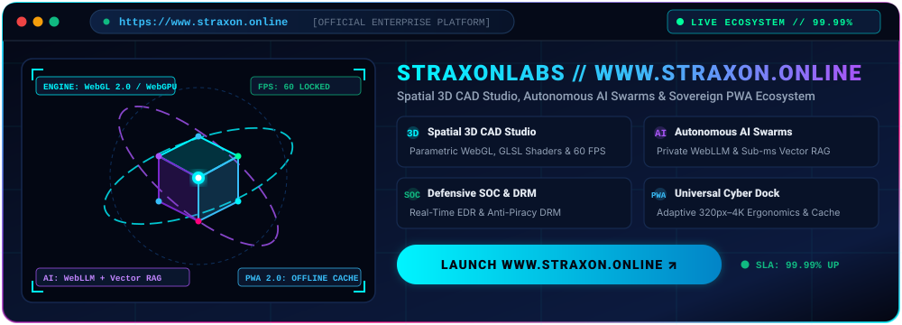
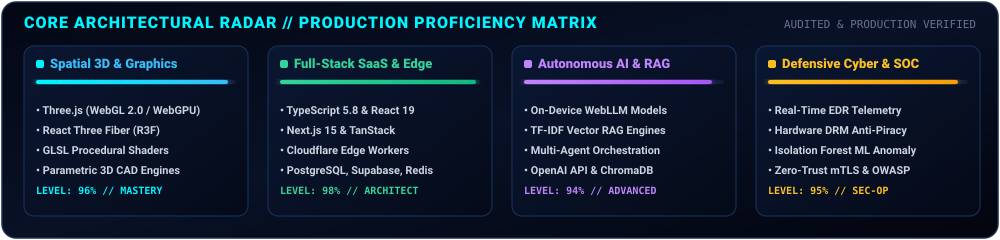

<div align="center">


<!-- ======================================================================= -->
<!-- 🚀 CYBERNETIC HERO BANNER & IDENTITY MATRIX -->
<!-- ======================================================================= -->

<a href="https://www.straxon.online/">
  
</a>

<!-- Dynamic Animated Cyber Typing Headline -->
<a href="https://www.straxon.online/">
  
</a>

<p align="center">
  
  <a href="https://www.straxon.online/"></a>
  
  
  
</p>

<!-- Recruiter & Client Priority Quick-Action Launchpad -->
<p align="center">
  <a href="https://www.straxon.online/"></a>
  <a href="https://wa.me/918335846171?text=Hello%20Swaraj,%20I%20would%20like%20to%20discuss%20a%20high-impact%20project%20architecture."></a>
  <a href="mailto:straxonlab@gmail.com"></a>
  <a href="https://tanstack-start-app.hybridpython64.workers.dev/"></a>
  <a href="https://w.swaraj-0aa.workers.dev/"></a>
</p>

<p align="center">
  <a href="https://www.straxon.online/"><b>🌐 www.straxon.online</b></a> •
  <a href="https://straxonlabs10.vercel.app/"><b>🚀 Mirror Platform</b></a> •
  <a href="https://w.swaraj-0aa.workers.dev/"><b>🤖 W Neural OS</b></a> •
  <a href="https://tanstack-start-app.hybridpython64.workers.dev/"><b>🛡️ Straxon Cyber SOC</b></a> •
  <a href="https://straxon-command-center.onrender.com/"><b>⚡ Command Suite</b></a> •
  <a href="https://kshatracode-frontend.onrender.com/"><b>🔒 Kshatra Code DRM</b></a>
</p>

---

</div>

## 🌐 Flagship Enterprise Application // www.straxon.online

<div align="center">
  <a href="https://www.straxon.online/">
    
  </a>
</div>

<div align="center">
  <p>
    <a href="https://www.straxon.online/"></a>
    <a href="https://www.straxon.online/saas-tools"></a>
    <a href="https://www.straxon.online/contact"></a>
  </p>
</div>

> **StraxonLabs** (`www.straxon.online`) is an autonomous next-generation engineering ecosystem uniting **Spatial 3D CAD modeling**, **browser-native private AI inference**, **enterprise SOC threat telemetry**, and a **universal tactile cyber dock**. Engineered with zero third-party framework compromise, it achieves a locked **60 FPS GPU canvas**, **sub-millisecond vector retrieval**, and an offline-resilient **Progressive Web App (PWA 2.0)** runtime distributed across 300+ global edge locations.

---

## 🎯 Core Architectural Proficiency // Production Radar

<div align="center">
  
</div>

<br/>

<div align="center">

| Domain | What I Deliver to Clients & Organizations | Key Weapons & Runtimes |
| :--- | :--- | :--- |
| **01. Spatial 3D & Graphics** | In-browser CAD studios, 3D configurators, custom GLSL raymarching shaders, locked 60 FPS across desktop & mobile. | Three.js, WebGL 2.0, WebGPU, GLSL Shaders, React Three Fiber, Blender |
| **02. Full-Stack SaaS & Edge** | High-velocity 0-to-1 platforms, multi-tenant RBAC, automated Stripe billing, sub-100ms API endpoints worldwide. | TypeScript 5.8, React 19, Next.js 15, FastAPI, Node.js, Cloudflare Workers, PostgreSQL |
| **03. Autonomous AI & Vector RAG** | Zero-cloud-cost on-device WebLLM inference, sub-ms cosine vector retrieval, multi-agent automated orchestration. | WebLLM, TF-IDF Vector RAG, ChromaDB, OpenAI API, Multi-Agent Swarms |
| **04. Defensive Cyber & SOC** | Real-time EDR attack matrix, hardware canvas fingerprinting, anti-tamper memory hooks, Zero-Trust mTLS & OWASP audits. | Python EDR, Cloudflare WAF, Isolation Forest ML, Hardware DRM, WireGuard |

</div>

---

## 🌌 Live Flagship Production Deployments

<div align="center">

| Platform & Status | Domain & Core Innovations | Production Uplink |
| :--- | :--- | :--- |
| **🌐 StraxonLabs Platform**<br/> | **Next-Gen Spatial 3D CAD & Autonomous AI Ecosystem:** Universal Cyber Dock, 8 Autonomous SaaS Engines, parametric 3D CAD modeling, procedural GLSL shaders, Web Audio synth & offline-resilient PWA 2.0. | [**🚀 straxon.online ↗**](https://www.straxon.online/)<br/><sub>[Vercel Mirror ↗](https://straxonlabs10.vercel.app/)</sub> |
| **🛡️ Straxon Cyber SOC**<br/> | **Enterprise SOC Threat Visualizer & Defense Mesh:** 3D interactive cyber attack origin globe, ML-powered EDR telemetry (Isolation Forest anomaly detection), live DDoS simulation & Zero-Trust mTLS. | [**🛡️ Launch Cyber SOC ↗**](https://tanstack-start-app.hybridpython64.workers.dev/)<br/><sub>[Vercel Mirror ↗](https://straxon-secure.vercel.app/)</sub> |
| **🤖 W Neural OS v3.0**<br/> | **Autonomous Multi-Agent AI Operating System:** Cloudflare Edge Worker AI orchestration, browser-native WebLLM inference, task handoff state machines & sub-millisecond TF-IDF vector RAG retrieval. | [**🤖 Launch Neural OS ↗**](https://w.swaraj-0aa.workers.dev/) |
| **⚡ Straxon Command Suite**<br/> | **Full-Stack Enterprise Operations Suite:** High-velocity distributed control plane, dynamic IEEE 830 SRS documentation generator, client milestone escrow & team RBAC governance. | [**⚡ Launch Command ↗**](https://straxon-command-center.onrender.com/) |
| **🔒 Kshatra Code DRM**<br/> | **Cultural EdTech with Anti-Piracy Hardware DRM:** Client hardware device fingerprinting, anti-tamper memory hooks, dynamic steganographic watermark injection & encrypted media delivery. | [**🔒 Launch Kshatra Code ↗**](https://kshatracode-frontend.onrender.com/) |
| **🐠 The Fish World**<br/> | **High-Velocity Marine Livestock Commerce:** Real-time inventory sync engine, sub-second checkout pipeline, Stripe API payments & interactive marine specimen telemetry. | [**🐠 Visit The Fish World ↗**](https://thefishworld.vercel.app/) |

</div>

---

## ⚡ Real-Time Architecture & Defense Telemetry

<div align="center">
  
</div>

<br/>

---

## 📊 Live GitHub Engineering Telemetry

<div align="center">

<p align="center">
  <a href="https://github.com/PythonWTFFF">
    
  </a>
  <a href="https://github.com/PythonWTFFF">
    
  </a>
</p>

<p align="center">
  <a href="https://github.com/PythonWTFFF">
    
  </a>
</p>

</div>

---

## 🚀 High-Velocity Sprint Architecture // 14-Day Delivery Commitment

<div align="center">

```
┌──────────────────────────────────────────────────────────────────────────────────────────────────┐
│                             HIGH-IMPACT SPRINT PROCESS (14 DAYS)                                 │
├─────────────────────┬────────────────────────────────────────────────────────────────────────────┤
│ 01. THREAT & SPEC   │ Day 1–2: Complete architecture blueprint, threat modeling & SRS spec.     │
│ 02. ACCELERATION    │ Day 3–9: 3D spatial scenes, AI agents, database schemas & edge APIs.       │
│ 03. HARDENING & SLA │ Day 10–14: Zero-Trust mTLS, OWASP defense, automated CI/CD & global CDN.   │
└─────────────────────┴────────────────────────────────────────────────────────────────────────────┘
```

</div>

---

## 🤝 Client Engagement Protocol & Direct High-Priority Uplinks

<div align="center">

Whether you need to architect a **production full-stack SaaS platform**, engineer **3D WebGL / WebGPU spatial computing**, deploy **autonomous multi-agent AI systems**, or execute a **military-grade cybersecurity audit**, let's build something extraordinary together.

<p align="center">
  <a href="https://wa.me/918335846171?text=Hello%20Swaraj,%20I%20would%20like%20to%20discuss%20a%20high-impact%20project%20architecture."></a>
  <a href="mailto:straxonlab@gmail.com"></a>
  <a href="https://www.straxon.online/"></a>
  <a href="https://github.com/PythonWTFFF"></a>
</p>

<div align="center">
  
</div>

<p align="center">
  <sub><code>[SECURE HASH: 0x7E3A9F // STRAXON SOVEREIGN ENTERPRISE ARCHITECTURE]</code></sub><br/>
  <sub>Copyright © 2026 <b>Swaraj Panti (dark hat)</b> // StraxonLabs Ecosystem. Engineered with sovereign cybernetic precision.</sub>
</p>

</div>
