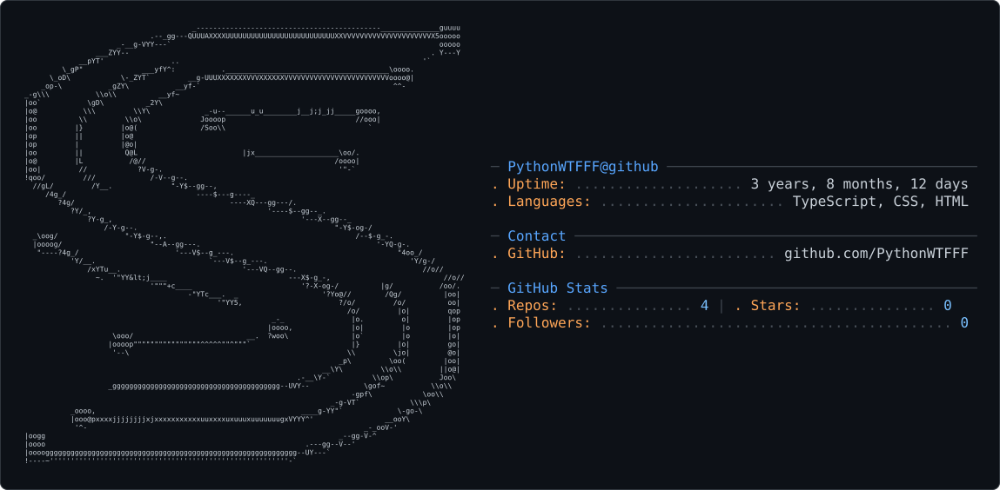

<picture>
  <source media="(prefers-color-scheme: dark)" srcset="dark_mode.svg" />
  <source media="(prefers-color-scheme: light)" srcset="light_mode.svg" />
  
</picture>

<h1 align="center">Swaraj Panti // StraxonLabs</h1>
<h3 align="center">Full-Stack Software Architect • Spatial Computing Engineer • Cyber Defense Researcher</h3>

  
  
  

  

---

### 🌌 Flagship Production Platforms

| Platform | Domain / Architecture | Live URL |
| :--- | :--- | :--- |
| **StraxonLabs** | 3D WebGL CAD Studio, Procedural GLSL Shaders, Web Audio Synthesizer & Autonomous PWA | [straxonlabs10.vercel.app](https://straxonlabs10.vercel.app/) |
| **Straxon Secure** | Real-Time SOC Threat Visualizer, Hands-on Attack Labs & Cloudflare Edge Defense | [tanstack-start-app.hybridpython64.workers.dev](https://tanstack-start-app.hybridpython64.workers.dev/) |
| **Straxon Command Center** | Centralized Enterprise OS, Dynamic SRS Documentation Generator & Encrypted Vaults | [straxon-command-center.onrender.com](https://straxon-command-center.onrender.com/) |
| **Kshatra Code** | Cultural EdTech Platform with Military-Grade Anti-Piracy Hardware DRM Encryption | [kshatracode-frontend.onrender.com](https://kshatracode-frontend.onrender.com/) |
| **The Fish World** | High-Velocity Exotic Marine Livestock Retail Platform with Real-Time Inventory & Checkout | [thefishworld.vercel.app](https://thefishworld.vercel.app/) |

---

### 🛠️ Core Technology Arsenal

  <!-- Languages & Graphics -->
  
  
  
  
  
  
   
  <!-- Frontend & Frameworks -->
  
  
  
  
  
   
  <!-- Backend, Cloud & Databases -->
  
  
  
  
  
  
  
   
  <!-- Cybersecurity & Infrastructure -->
  
  
  
  

---

### 📊 GitHub Activity & Real-Time Telemetry

  
  

  

---

### 📬 Direct Collaboration & Contact

- 🌐 **Platform:** [straxonlabs10.vercel.app](https://straxonlabs10.vercel.app/)
- 💬 **WhatsApp Direct:** [+91 8335846171](https://wa.me/918335846171)
- ✉️ **Email:** [straxonlab@gmail.com](mailto:straxonlab@gmail.com)
- 📍 **Focus Areas:** High-Scale Full-Stack SaaS, 3D Spatial Computing, Interactive WebGL Studios, Enterprise SOC Architecture

  © 2026 Swaraj Panti • StraxonLabs. Engineered for the next era of digital computing.

