<div align="center">

<!-- ═════════════════════════════════════════════════════════════════════════ -->
<!-- 🚀 CYBERNETIC HERO BANNER & IDENTITY MATRIX -->
<!-- ═════════════════════════════════════════════════════════════════════════ -->

<a href="https://straxonlabs10.vercel.app/">
  
</a>

<!-- Dynamic Animated Cyber Typing Headline -->
<a href="https://straxonlabs10.vercel.app/">
  
</a>

<p align="center">
  
  <a href="https://straxonlabs10.vercel.app/"></a>
  
  
  
</p>

<!-- Quick Action Navigation Capsules -->
<p align="center">
  <a href="https://straxonlabs10.vercel.app/"><b>🚀 Flagship Platform</b></a> •
  <a href="https://www.straxon.online/"><b>🌐 straxon.online</b></a> •
  <a href="https://w.swaraj-0aa.workers.dev/"><b>🤖 W Neural OS</b></a> •
  <a href="https://tanstack-start-app.hybridpython64.workers.dev/"><b>🛡️ Cyber SOC</b></a> •
  <a href="https://straxon-command-center.onrender.com/"><b>⚡ Command Suite</b></a> •
  <a href="https://wa.me/918335846171"><b>💬 WhatsApp Direct</b></a>
</p>

---

</div>

## ⚡ Real-Time Architecture & Defense Telemetry

<div align="center">
  
</div>

<br/>

```text
┌──[ dark-hat@straxon-core ]──[ /sys/kernel/security/telemetry ]
└──╼ $ neofetch --profile --threat-level zero-day

       _--__g-VYY---`           NODE_ID        : straxon-defense-node-01
    _-g\\\       \\o\\          ARCHITECT      : Swaraj Panti (dark hat / @PythonWTFFF)
   |oo`           \gD\          ROLE           : Founder & Lead Systems Architect @ StraxonLabs
   |o@    [0x7E]   \\Y\         SECURITY LEVEL : Level 4 // Offensive & Defensive Research
   |oo             \\o\         SPECIALIZATION : Real-Time SOC EDR, 3D Spatial Graphics, WebLLM, DRM
   |op             |o@          EDGE RUNTIMES  : Cloudflare Workers • Vercel Edge • Docker Container Meshes
   !qoo/          /-V--g-.      ENGINE         : Three.js • WebGL 2.0 • WebGPU • GLSL Procedural Shaders
      /4g_/       ----$---g     UPTIME         : 99.99% // Continuous Autonomous Innovation
```

---

## 🌌 Live Flagship Deployments

<div align="center">

| Platform & Status | Domain & Core Innovations | Production Uplink |
| :--- | :--- | :--- |
| **⚡ StraxonLabs v3.0 Ultra**<br/> | **Spatial 3D WebGL/WebGPU CAD Studio & Ergonomic OS:** Universal Cyber Dock, 8 Autonomous SaaS Engines, parametric 3D CAD modeling, procedural GLSL shaders, Web Audio synth & offline-resilient PWA 2.0. | [**Explore Platform ↗**](https://straxonlabs10.vercel.app/)<br/><sub>[straxon.online ↗](https://www.straxon.online/)</sub> |
| **🤖 W Neural OS v3.0**<br/> | **Autonomous Multi-Agent AI Operating System:** Cloudflare Edge Worker AI orchestration, browser-native WebLLM inference, task handoff state machines & sub-millisecond TF-IDF vector RAG retrieval. | [**Launch Neural OS ↗**](https://w.swaraj-0aa.workers.dev/) |
| **🛡️ Straxon Secure SOC**<br/> | **Enterprise SOC Threat Visualizer & Defense Mesh:** 3D interactive cyber attack origin globe, ML-powered EDR telemetry (Isolation Forest anomaly detection), live DDoS simulation & Zero-Trust mTLS. | [**Access Cyber SOC ↗**](https://tanstack-start-app.hybridpython64.workers.dev/)<br/><sub>[Vercel Mirror ↗](https://straxon-secure.vercel.app/)</sub> |
| **⚡ Straxon Command Center**<br/> | **Full-Stack Enterprise Operations Suite:** High-velocity distributed control plane, dynamic IEEE 830 SRS documentation generator, client milestone escrow & team RBAC governance. | [**Launch Command ↗**](https://straxon-command-center.onrender.com/) |
| **🔒 Kshatra Code**<br/> | **Cultural EdTech with Anti-Piracy Hardware DRM:** Client hardware device fingerprinting, anti-tamper memory hooks, dynamic steganographic watermark injection & encrypted media delivery. | [**Launch Kshatra Code ↗**](https://kshatracode-frontend.onrender.com/) |
| **🐠 The Fish World**<br/> | **High-Velocity Marine Livestock Commerce:** Real-time inventory sync engine, sub-second checkout pipeline, Stripe API payments & interactive marine specimen telemetry. | [**Visit The Fish World ↗**](https://thefishworld.vercel.app/) |

</div>

---

## 🛠️ The 8 Autonomous Sovereign SaaS Engines

<div align="center">

```
┌──────────────────────────────────────────────────────────────────────────────────────────────────┐
│                               STRAXON AUTONOMOUS SAAS ENGINE SUITE                               │
├────┬─────────────────────────────┬───────────────────────────────────────────────────────────────┤
│ 01 │ 📐 Spatial 3D CAD Studio    │ Parametric geometry, GLSL raymarching & WebGPU compute        │
│ 02 │ 🎛️ Web Audio Synth Matrix   │ Polyphonic synth, custom oscillators & low-pass biquad filters│
│ 03 │ 🛡️ Real-Time SOC Telemetry   │ 3D geospatial attack visualizer & zero-trust packet inspector │
│ 04 │ 🧠 Neural Vector RAG Engine │ In-browser vector TF-IDF cosine similarity & sub-ms retrieval │
│ 05 │ 📋 IEEE 830 SRS Architect   │ Automated software requirement specification compiler         │
│ 06 │ 🔒 Hardware DRM Matrix      │ Biometric canvas fingerprinting & forensic anti-leak tracing  │
│ 07 │ 🔍 Zero-Trust Vulnerability │ Automated OWASP Top-10 audit & TLS 1.3 handshake verification │
│ 08 │ 📱 Universal Cyber Dock     │ Responsive 320px–4K navigation ergonomics & tactile haptics   │
└────┴─────────────────────────────┴───────────────────────────────────────────────────────────────┘
```

</div>

---

## ⚔️ Weapons of Choice // Technology Arsenal

<div align="center">

### 💻 Languages & Core Runtimes
<p align="center">
  
  
  
  
  
  
  
  
</p>

### 🎮 Spatial Computing, 3D & Frontend Architecture
<p align="center">
  
  
  
  
  
  
  
  
</p>

### 🧠 Autonomous AI Swarms & Neural Vector Inference
<p align="center">
  
  
  
  
  
</p>

### 🛡️ Cyber Defense, SOC & Cloud Infrastructure
<p align="center">
  
  
  
  
  
  
  
  
</p>

</div>

---

## 📊 Live GitHub Telemetry & Activity Matrix

<div align="center">

<!-- GitHub Stats & Languages Side by Side (Responsive Flex Layout for Mobile & Desktop) -->
<p align="center">
  <a href="https://github.com/PythonWTFFF">
    
  </a>
  <a href="https://github.com/PythonWTFFF">
    
  </a>
</p>

<!-- GitHub Streak Stats -->
<p align="center">
  <a href="https://github.com/PythonWTFFF">
    
  </a>
</p>

<!-- Dynamic Activity Graph -->
<p align="center">
  <a href="https://github.com/PythonWTFFF">
    
  </a>
</p>

</div>

---

## 🏗️ Sovereign Engineering Architecture Flow

```mermaid
flowchart LR
    subgraph ClientNodes ["Client Devices (320px Mobile ➔ 4K Workstations)"]
        DOCK["Universal Cyber Dock"]
        UI["React 18 + Framer Motion"]
        R3F["Three.js WebGL / WebGPU"]
        AUDIO["Web Audio Synth + Haptics"]
    end

    subgraph EdgeIntelligence ["Autonomous Edge Engine"]
        RAG["Vector RAG Cosine Engine"]
        LLM["WebLLM On-Device Neural Model"]
        SWARM["Multi-Agent SOW Generator"]
        SAAS["8 Sovereign SaaS Tools"]
    end

    subgraph DefenseMesh ["Cyber Defense & Cloud Telemetry"]
        SOC["3D Threat Intelligence Globe"]
        OWASP["Zero-Trust TLS 1.3 Scanner"]
        WORKERS["Cloudflare Edge Workers"]
        DB["PostgreSQL + Supabase RLS"]
    end

    ClientNodes --> EdgeIntelligence
    EdgeIntelligence --> DefenseMesh
```



---

## 🔐 Zero-Trust Architectural Protocols & Deep Tech

<details>
  <summary><b>▶ [CLICK TO EXPAND] DEFENSIVE SOC &amp; EDR TELEMETRY SPECIFICATIONS</b></summary>
  <br/>
  <blockquote>
    <p><b>Threat Ingestion Architecture:</b> Telemetry daemons stream real-time process execution trees, anomalous network sockets, and syscall entropy straight into an asynchronous ingestion queue. Built with FastAPI and WebSocket multiplexing, events are classified using an Isolation Forest anomaly detection model to flag Domain Generation Algorithms (DGA) and memory tampering in under 80ms.</p>
  </blockquote>
</details>

<details>
  <summary><b>▶ [CLICK TO EXPAND] 3D SPATIAL COMPUTING &amp; PROCEDURAL SHADER PIPELINE</b></summary>
  <br/>
  <blockquote>
    <p><b>WebGL / WebGPU Engineering:</b> The StraxonLabs 3D CAD engine renders parametric geometry directly on the GPU canvas. Utilizing custom vertex and fragment GLSL shaders, procedural normal mapping, and raymarching techniques, complex spatial environments achieve a locked 60 FPS across desktop and mobile PWA runtimes.</p>
  </blockquote>
</details>

<details>
  <summary><b>▶ [CLICK TO EXPAND] HARDWARE-ENFORCED VIDEO DRM &amp; ANTI-PIRACY PROTOCOLS</b></summary>
  <br/>
  <blockquote>
    <p><b>Anti-Screen Recording &amp; Leak Tracing:</b> Custom biometric and hardware canvas fingerprinting binds each media session to physical hardware attributes. Moving dynamic steganographic micro-watermarks are rendered offscreen into encrypted frame buffers, enabling instant forensic tracing of illicit redistributions.</p>
  </blockquote>
</details>

---

## 💬 Direct Uplink & Secure Transmission

<div align="center">

Whether you're looking to architect an **enterprise SaaS platform**, integrate **3D WebGL / WebGPU spatial computing**, deploy **autonomous multi-agent AI systems**, or undergo a **full-stack cybersecurity audit**, let's build something extraordinary together.

<p align="center">
  <a href="https://wa.me/918335846171"></a>
  <a href="mailto:straxonlab@gmail.com"></a>
  <a href="https://www.straxon.online/"></a>
  <a href="https://github.com/PythonWTFFF"></a>
</p>

<div align="center">
  
</div>

<p align="center">
  <sub><code>[SECURE HASH: 0x7E3A9F // STRAXON SOVEREIGN ARCHITECTURE]</code></sub><br/>
  <sub>Copyright © 2026 <b>Swaraj Panti (dark hat)</b> // StraxonLabs. Engineered with sovereign cybernetic precision.</sub>
</p>

</div>
